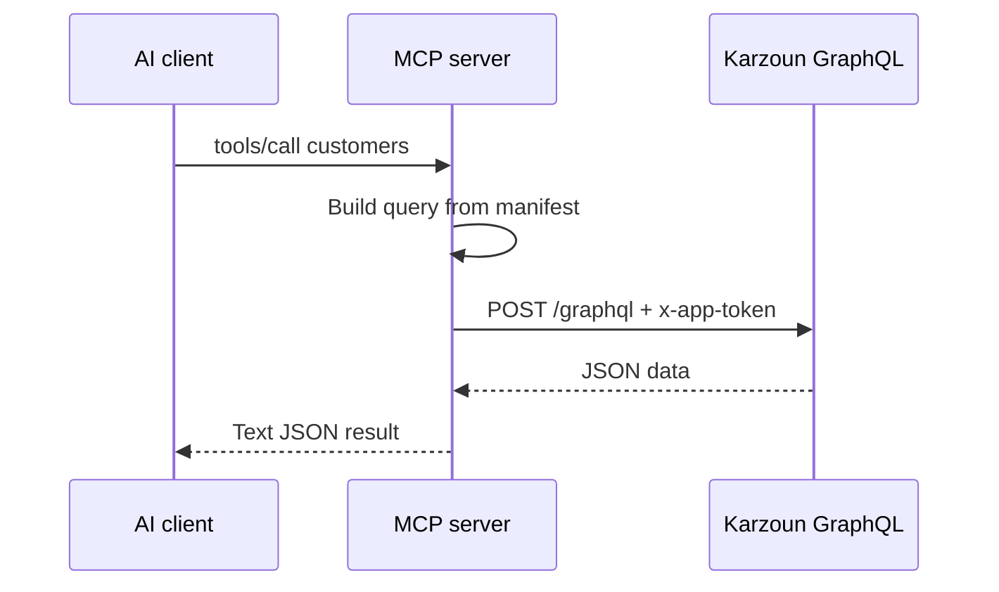

كرزون MCP جسر رفيع: **أداة MCP واحدة = عملية GraphQL عامة واحدة**. لا واجهات مخفية، ولا طبقة تجريد إضافية.

## مسار الطلب



1. يختار الوكيل أداة (مثل `customerDetail`) ويمرّر الحجج.
2. يبني خادم MCP استعلام أو تعديل GraphQL من بيان الأدوات المعتمد.
3. يرسل الخادم POST إلى عنوان GraphQL للمستأجر مع `x-app-token`.
4. تُعاد النتيجة كنص JSON إلى الوكيل.

تطبَّق نفس [صلاحيات رمز التطبيق](/ar/developers/getting-started/authentication) — إذا لم يستطع التطبيق تشغيل عملية في ساحة التجربة، فلن يستطيع MCP تشغيلها أيضًا.

## تسمية الأدوات

أسماء الأدوات **تطابق أسماء عمليات GraphQL** تمامًا:

| الأداة           | عملية GraphQL            |
| -------------- | ----------------------------- |
| `tags`         | `query tags(...)`            |
| `customersAdd` | `mutation customersAdd(...)` |
| `webhooks`     | `query webhooks(...)`        |

تصفّح القائمة الكاملة في [كتالوج الأدوات](/ar/mcp-server/tools/catalog). توثيق الحقول موجود في [مرجع GraphQL](/api-reference).

## تقييد الأدوات

قد تُثقل البيانات الكبيرة النماذج الأصغر. عيّن بادئة لعرض ما تحتاجه فقط:

```json
"env": {
  "KARZOUN_API_URL": "https://YOUR.api.karzoun.chat/graphql",
  "KARZOUN_APP_TOKEN": "YOUR_TOKEN",
  "KARZOUN_MCP_TOOL_PREFIX": "customers"
}
```

تُسجَّل فقط الأدوات التي تبدأ أسماؤها بـ `customers` (مثل `customers`، `customersAdd`، `customerDetail`).

## حجم الاستجابة

تُحدَّ الاستجابة بـ **512 كيلوبايت** افتراضيًا (`KARZOUN_MCP_MAX_RESPONSE_BYTES`). إذا أعاد استعلام قائمة بيانات أكثر من اللازم، تفشل الأداة بخطأ واضح — ضيّق `page` / `perPage` أو حجج التصفية، كما في [الترقيم](/ar/developers/guides/pagination) في GraphQL.

## الأخطاء

تعيد الأدوات الفاشلة JSON بحقل `error`:

```json
{ "error": "Permission denied" }
```

تظهر إخفاقات HTTP، وأخطاء التحقق من GraphQL، والاستجابات الكبيرة بهذا الشكل. علّم وكيلك قراءة الرسالة وتعديل الحجج.

## Stdio مقابل المستضاف

| النقل  | العملية                               | مصدر الرمز                          |
| ---------- | ---------------------------------------- | ---------------------------------------- |
| **stdio**  | عملية Node محلية يطلقها بيئة التطوير | `KARZOUN_APP_TOKEN` في `env` إعداد MCP |
| **المستضاف** | مسار البوابة `POST /mcp`             | ترويسة `x-app-token` لكل طلب      |

يدعم الوضع المستضاف أيضًا `x-subdomain` اختياريًا عند التوجيه عبر بوابات متعددة المستأجرين. راجع [MCP المستضاف](/ar/mcp-server/setup/hosted).

## ما لا يفعله MCP

- بث أحداث البريد الوارد في الوقت الفعلي — استخدم [خطافات الويب](/ar/developers/guides/webhooks)
- تسجيل MiniApps — راجع [MiniApps](/ar/miniapps)
- تجاوز فحوصات الصلاحيات — تُحدَّد نطاقات التطبيقات في **المطوّر ← التطبيقات**
