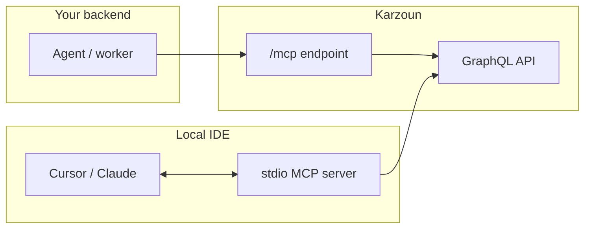

امنح مساعدي الذكاء الاصطناعي **وصولًا منظمًا** إلى حساب كرزون — العملاء، الوسوم، المنتجات، المستخدمون، خطافات الويب، والمزيد — عبر [Model Context Protocol](https://modelcontextprotocol.io/).

تحوّل حزمة `@karzounchat/mcp-server` **واجهة GraphQL العامة** إلى أدوات MCP **واحدًا لواحد**. عندما يستدعي الوكيل `customers`، ينفّذ نفس العملية التي ترسلها من [ساحة التجربة](https://karzoun.chat/developer/playground) أو من الخلفية لديك.

**الحزمة:** [`@karzounchat/mcp-server`](https://www.npmjs.com/package/@karzounchat/mcp-server)
**المصدر:** [KarzounApps/mcp-server](https://github.com/KarzounApps/mcp-server)

<Tip title="نظرة عامة بالفيديو">
  **قريبًا:** _كرزون MCP في 3 دقائق_ — ما هو MCP، متى تستخدم stdio مقابل الاستضافة، وعرض مباشر في Cursor. _(مكان مخصص للتضمين)_
</Tip>

## اختر إعدادك

|                 | **محلي (stdio)**                                                     | **مستضاف (`/mcp`)**                                                     |
| --------------- | --------------------------------------------------------------------- | ----------------------------------------------------------------------- |
| **الأفضل لـ**    | Cursor، Claude Desktop، التطوير المحلي                                     | وكلاء الخلفية، الأتمتة، عمال SaaS                               |
| **يعمل كـ**     | `npx @karzounchat/mcp-server` على جهازك                         | HTTP على بوابة كرزون                                                 |
| **مكان الرمز** | إعداد MCP في `env` (جهازك)                                        | خادمك فقط — لا في المتصفح أبدًا                                    |
| **دليل الإعداد** | [Cursor](/ar/mcp-server/setup/cursor) · [Claude Desktop](/ar/mcp-server/setup/claude-desktop) | [موصّلات الذكاء الاصطناعي](/ar/mcp-server/setup/ai-connectors) · [MCP المستضاف](/ar/mcp-server/setup/hosted) |

## المتطلبات المسبقة

1. **رمز التطبيق** — أنشئه من **المطوّر ← التطبيقات** ([دليل المصادقة](/ar/developers/getting-started/authentication))
2. **عنوان GraphQL** — `https://{subdomain}.api.karzoun.chat/graphql` ([البداية السريعة](/ar/developers/getting-started/quickstart))
3. **الصلاحيات** — اضبط نطاق التطبيق على العمليات التي يحتاجها وكيلك

<Warning title="ليس بديلاً عن GraphQL">
  MCP طبقة **تيسير لعملاء الذكاء الاصطناعي**. التكاملات الإنتاجية التي لا تحتاج نموذج لغة كبير يجب أن تستدعي GraphQL أو [خطافات الويب](/ar/developers/guides/webhooks) مباشرة.
</Warning>

## ابدأ من هنا

| الخطوة | الدليل                                                                                                                                    |
| ---- | ---------------------------------------------------------------------------------------------------------------------------------------- |
| 1    | [كيف يعمل](/ar/mcp-server/guides/how-it-works) — الأدوات، المصادقة، والاستجابات                                                                      |
| 2    | اختر إعدادًا: [Cursor](/ar/mcp-server/setup/cursor)، [موصّلات الذكاء الاصطناعي](/ar/mcp-server/setup/ai-connectors) (Claude، Manus، ChatGPT…)، أو [المستضاف](/ar/mcp-server/setup/hosted) |
| 3    | [أنماط الوكلاء](/ar/mcp-server/guides/agent-patterns) — أوامر تعمل جيدًا                                                                      |
| 4    | [كتالوج الأدوات](/ar/mcp-server/tools/catalog) — أكثر من **75** عملية                                                                     |

## مرجع الإعداد

| المتغير                         | مطلوب | الوصف                            |
| --------------------------------- | -------- | --------------------------------------- |
| `KARZOUN_API_URL`                | نعم      | عنوان نقطة نهاية GraphQL                   |
| `KARZOUN_APP_TOKEN`              | نعم      | JWT التطبيق من `appsAdd`                 |
| `KARZOUN_MCP_TOOL_PREFIX`        | لا       | تقييد الأدوات (مثل `tags`، `customers`) |
| `KARZOUN_MCP_MAX_RESPONSE_BYTES` | لا       | حد حجم الاستجابة (الافتراضي: 524288)         |

ما زالت أسماء متغيرات البيئة الأقدم من الإصدارات السابقة مقبولة كاحتياطي.

## ذات صلة

- [الأمان](/ar/mcp-server/setup/security) — التعامل مع الرموز والصلاحيات
- [استكشاف الأخطاء](/ar/mcp-server/guides/troubleshooting) — أخطاء MCP الشائعة
- [GraphQL API](/ar/developers) — الواجهة البرمجية، خطافات الويب، ساحة التجربة
