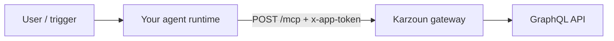

يحوّل MCP المستضاف مساحة عمل كرزون إلى **أدوات حية** لوكلاء الذكاء الاصطناعي السحابيين — نفس عمليات GraphQL التي تستخدمها في [ساحة التجربة](https://karzoun.chat/developer/playground)، معروضة كأدوات MCP مسماة يمكن لنموذج اللغة استدعاؤها نيابة عنك.

استخدم هذا الدليل عندما يعمل تطبيق الذكاء الاصطناعي في **السحابة** (Claude.ai، Manus، ChatGPT، Cursor عن بُعد) ويجب أن يصل إلى كرزون عبر **HTTPS**، وليس عبر `npx` على جهازك.

<Tip title="الإعداد داخل التطبيق">
  افتح **المطوّر ← إعداد MCP** في كرزون (`/developer/mcp-setup`) للحصول على عنوان نقطة النهاية الخاص بمستأجرك ومثال curl لـ `initialize` جاهز للنسخ.
</Tip>

## تفاصيل اتصالك

اجمع هذه مرة واحدة قبل ربط أي عميل:

| الحقل            | القيمة                                                                                             |
| ---------------- | --------------------------------------------------------------------------------------------------- |
| **عنوان MCP**      | `https://{subdomain}.api.karzoun.chat/mcp`                                                        |
| **ترويسة المصادقة**  | `x-app-token: YOUR_APP_JWT`                                                                       |
| **النقل**    | Streamable HTTP (POST + بث GET اختياري)                                                      |
| **مصدر الرمز** | **المطوّر ← التطبيقات** — [دليل المصادقة](/ar/developers/getting-started/authentication) |

```bash
# Quick sanity check (save mcp-session-id from response headers)
curl -sD - -X POST 'https://YOUR.api.karzoun.chat/mcp' \
  -H 'Content-Type: application/json' \
  -H 'Accept: application/json, text/event-stream' \
  -H 'x-app-token: YOUR_TOKEN' \
  -d '{"jsonrpc":"2.0","id":1,"method":"initialize","params":{"protocolVersion":"2024-11-05","capabilities":{},"clientInfo":{"name":"test","version":"1.0.0"}}}'
```

المصافحة الكاملة: [MCP المستضاف](/ar/mcp-server/setup/hosted).

<Warning title="رموز من جهة الخادم فقط">
  لا تلصق رموز التطبيقات في إضافات المتصفح، أو إعدادات ChatGPT المشتركة، أو الشيفرة من جهة العميل. اتصل من مضيف ذكاء اصطناعي موثوق أو من خلفيتك. راجع [الأمان](/ar/mcp-server/setup/security).
</Warning>

## ما الذي تفتحه

يعرض كرزون **أكثر من 75 أداة** مربوطة 1:1 بواجهة GraphQL العامة. لا يحتاج الوكيل إلى اختراع صياغة الاستعلام — يستدعي الأدوات باسم العملية (`customers`، `tasksAdd`، `webhooks`، …).

تصفّح القائمة الكاملة: [كتالوج الأدوات](/ar/mcp-server/tools/catalog).

### حسب المجال

| المجال             | أمثلة أدوات                                  | ما يمكن للوكيل فعله                                    |
| ------------------ | ----------------------------------------------- | ---------------------------------------------------------- |
| **جهات الاتصال وCRM** | `customers`، `companies`، `tags`، `tagsTag`    | البحث عن الأشخاص، تقسيم القوائم، تطبيق الوسوم               |
| **صندوق الوارد**          | `conversations`، `conversationMessageAdd`      | قراءة المحادثات، صياغة أو إرسال ردود (ضمن نطاق التطبيق)  |
| **المهام**          | `tasks`، `tasksAdd`، `tasksBoards`             | سرد العمل، إنشاء متابعات، فحص اللوحات            |
| **خطافات الويب**       | `webhooks`، `webhooksAdd`                      | تسجيل اشتراكات الأحداث الصادرة                   |
| **قاعدة المعرفة** | `knowledgeBaseSearch`، `knowledgeBaseArticles` | تأصيل الإجابات في محتوى المساعدة لديك                     |
| **التطبيقات**           | `apps`، `appsAdd`                              | فحص أو تدوير بيانات اعتماد التكامل (نطاق إداري) |

### أوامر تُظهر القوة

بعد الاتصال، جرّب طلبات باللغة الطبيعية مثل:

- _"List my 10 most recently updated customers and summarize their tags."_
- _"Find open tasks assigned to me on the Sales board and group by due date."_
- _"Search the knowledge base for return policy and draft a short customer reply."_
- _"Show webhook subscriptions for customer events — which URLs are active?"_
- _"Find the conversation with alice@example.com and summarize the last 5 messages."_

اربط MCP مع [أنماط الوكلاء](/ar/mcp-server/guides/agent-patterns) حتى يقرأ النموذج قبل أن يعدّل.

<Tip title="مكان مخصص للقطة شاشة / فيديو">
  _قريبًا: تسجيل شاشة — ربط MCP المستضاف، ثم تشغيل بحث CRM + سير عمل وسوم في أمر واحد._
</Tip>

## اختر العميل المناسب

| العميل                                    | stdio محلي               | `/mcp` مستضاف            | المصادقة التي يتوقعها كرزون                      |
| ------------------------------------------ | -------------------------- | ------------------------- | -------------------------------------------- |
| [Cursor](#cursor-remote)                  | نعم (موصى به للتطوير) | نعم                      | ترويسة `x-app-token`                      |
| [Claude Desktop](/ar/mcp-server/setup/claude-desktop)       | نعم                       | عن بُعد عبر واجهة Connectors | ترويسة أو OAuth (حسب العميل)        |
| [Claude.ai](#claudeai)                    | —                         | نعم                      | عنوان موصّل مخصص؛ راجع ملاحظة المصادقة أدناه |
| [Manus](#manus)                           | —                         | نعم                      | HTTP + مفتاح API / ترويسات مخصصة           |
| [ChatGPT Apps](#chatgpt-apps-and-connectors) | لا                        | نعم (عن بُعد فقط)        | غالبًا OAuth 2.1 — راجع التحفظ              |
| [Claude Code](#claude-code)               | —                         | نعم                      | نقل HTTP + ترويسات                  |
| خلفيتك الخاصة                              | —                         | نعم                      | `x-app-token` في كل طلب            |

**قاعدة عامة:** إذا أتاح العميل تعيين **ترويسات HTTP مخصصة**، فإن MCP المستضاف لكرزون يعمل اليوم. إذا كان العميل يدعم فقط **اكتشاف OAuth** (شائع في ChatGPT Apps)، فتحتاج إلى وكيل وسيط صغير أو وكيل خلفية حتى يتوفر OAuth على كرزون.

## Claude.ai

يدعم Claude على الويب **موصّلات MCP عن بُعد مخصصة** (Settings → Connectors → Add custom connector).

<Steps>
  <Step title="أنشئ رمز تطبيق">
    في كرزون: **المطوّر ← التطبيقات** → أنشئ تطبيقًا بالصلاحيات التي يحتاجها وكيلك (ابدأ للقراءة فقط: العملاء، الوسوم، المهام).
  </Step>

  <Step title="أضف الموصّل">
    1. افتح [Claude Connectors](https://claude.ai/settings/connectors) (أو **Admin → Connectors** على Team/Enterprise).
    2. انقر **Add custom connector**.
    3. **Server URL:** `https://{subdomain}.api.karzoun.chat/mcp`
    4. إذا عرضت الواجهة حقول مصادقة **Advanced** ودعم خطتك بيانات اعتماد ثابتة، فضّل التوجيه عبر عميل يدرك الترويسات (Cursor عن بُعد، Manus، أو خلفيتك) حتى يُوثَّق OAuth لكرزون.
  </Step>

  <Step title="فعّل في المحادثة">
    استخدم قائمة **+** في محادثة → **Connectors** → فعّل كرزون لتلك المحادثة.

    اختبر: _"Using Karzoun tools, run currentUser and list my first 5 tags."_
  </Step>
</Steps>

<Info title="Claude Desktop مقابل Claude.ai">
  **Claude Desktop** للبرمجة المحلية ما زال الأفضل مع [stdio](/ar/mcp-server/setup/claude-desktop). **الموصّلات عن بُعد** في Claude.ai لجلسات السحابة — لا تضف عنوان HTTPS إلى `claude_desktop_config.json`؛ استخدم واجهة Connectors بدلًا من ذلك.
</Info>

## Manus

يدعم [Manus](https://manus.im/) **خوادم MCP مخصصة** عبر HTTP — ملاءمة قوية لكرزون المستضاف لأنك تستطيع الإشارة إلى عنوان `/mcp` عام وتزويد بيانات الاعتماد.

<Steps>
  <Step title="افتح Custom MCP">
    **Settings → Integrations → Custom MCP** (أو **+ Add custom MCP → Direct configuration**).
  </Step>

  <Step title="أدخل تفاصيل الخادم">
    | الحقل              | القيمة                                                                                    |
    | ------------------ | ------------------------------------------------------------------------------------------ |
    | **Name**           | `Karzoun` (أو اسم مساحة عملك)                                                       |
    | **Transport**      | `HTTP` / Streamable HTTP                                                                 |
    | **Server URL**     | `https://{subdomain}.api.karzoun.chat/mcp`                                               |
    | **Authentication** | API key / Bearer / custom — اربطه بـ `x-app-token` إذا عرضت الواجهة حقل ترويسة مخصصة |

    إذا كان Manus يوفّر حقل **API key** واحدًا فقط ويرسل `Authorization: Bearer`، فاستخدم وكيلًا عكسيًا رفيعًا على بنيتك يترجم `Authorization: Bearer <token>` → `x-app-token: <token>` (متقدم؛ أبقِ الوكيل خاصًا).
  </Step>

  <Step title="اختبر واستخدم">
    يتحقق Manus من الخادم ويعرض الأدوات المكتشفة. اذكر كرزون في الأوامر:

    _"Pull my top 10 customers by last updated date and create a Manus doc summarizing their tags."_

    المرجع الرسمي: [وثائق Manus custom MCP](https://manus.im/docs/integrations/custom-mcp).
  </Step>
</Steps>

## ChatGPT Apps والموصّلات

تدعم OpenAI **MCP عن بُعد** عبر **Apps / Connectors** (وضع المطوّر في إعدادات ChatGPT). يتصل ChatGPT من سحابة OpenAI — **stdio المحلي لا يعمل**.

<Steps>
  <Step title="فعّل وصول المطوّر">
    في ChatGPT: **Settings → Apps & Connectors** (أو **Connectors → Advanced**) → فعّل **Developer mode** إن كان متاحًا في خطتك.
  </Step>

  <Step title="أضف عنوان MCP">
    أنشئ تطبيقًا/موصّلًا جديدًا والصق:

    ```
    https://{subdomain}.api.karzoun.chat/mcp
    ```

    راجع الأدوات المكتشفة قبل تفعيل التطبيق في المحادثات.
  </Step>
</Steps>

<Warning title="متطلب OAuth">
  تتوقع العديد من تدفقات موصّلات ChatGPT **OAuth 2.1** مع تسجيل عميل ديناميكي. يصادق MCP المستضاف لكرزون عبر **`x-app-token`** (نفس واجهة GraphQL العامة)، وليس عبر نقاط نهاية اكتشاف OAuth.

  **ما يعمل اليوم:** الاتصال عبر [Manus](#manus)، [Cursor عن بُعد](#cursor-remote)، [Claude Code](#claude-code)، أو وكيل خلفية خاص يستدعي `/mcp` مباشرة.

  **بالنسبة لـ ChatGPT تحديدًا:** إذا فشل إعداد الموصّل عند المصادقة، شغّل أدوات كرزون من عامل خلفية (خادمك يحمل الرمز) أو استخدم بوابة MCP تضيف OAuth أمام كرزون. سنوثّق OAuth من الطرف الأول لـ ChatGPT عند توفره.
</Warning>

## Cursor (عن بُعد)

للفرق التي تفضّل **عدم** تشغيل `npx` محليًا، يدعم Cursor **MCP عن بُعد** عبر `url` + `headers` في `mcp.json`.

```json
{
  "mcpServers": {
    "karzoun-hosted": {
      "url": "https://YOUR_SUBDOMAIN.api.karzoun.chat/mcp",
      "headers": {
        "x-app-token": "${env:KARZOUN_APP_TOKEN}"
      }
    }
  }
}
```

صدّر `KARZOUN_APP_TOKEN` في ملف تعريف الصدفة (تطبيقات سطح المكتب قد لا تحمّل `.zshrc` — استخدم بيئة النظام أو أنماط الأسرار المدعومة في Cursor).

يجب أن يظهر **إعدادات Cursor ← MCP** بحالة **connected** مع نحو 75 أداة. فضّل [stdio المحلي](/ar/mcp-server/setup/cursor) للتطوير دون اتصال؛ واستخدم **المستضاف** عندما يكون `npx` محظورًا أو تريد نقطة نهاية مشتركة واحدة.

الوثائق: [Cursor MCP — remote servers](https://cursor.com/docs/mcp).

## Claude Code

يمكن لـ [Claude Code](https://docs.anthropic.com/en/docs/claude-code) تسجيل خوادم MCP عبر HTTP من سطر الأوامر:

```bash
claude mcp add --transport http karzoun \
  https://YOUR_SUBDOMAIN.api.karzoun.chat/mcp \
  --header "x-app-token: YOUR_APP_TOKEN"
```

استخدم `.mcp.json` للمشروع للوصول على مستوى المستودع. دوّر الرموز عبر **المطوّر ← التطبيقات** إذا شارك إعداد CLI.

## ابنِ وكيلك الخاص

أي مكدس يتحدث **Streamable HTTP MCP** يمكنه استدعاء كرزون:



المضيفات النموذجية: LangGraph، عمال Node/Python مخصصون، أتمتة بأسلوب Zapier، بوتات Slack داخلية.

1. `POST initialize` → التقط `mcp-session-id`
2. `POST tools/list` → اكتشف العمليات
3. `POST tools/call` → نفّذ بحجج بشكل GraphQL

أمثلة وcurl: [MCP المستضاف](/ar/mcp-server/setup/hosted). تصميم الأوامر: [أنماط الوكلاء](/ar/mcp-server/guides/agent-patterns).

## ضيّق نطاق الرموز لوكلاء أكثر أمانًا

قبل ربط عميل قوي:

| الهدف                    | صلاحيات التطبيق                     | بيئة اختيارية                            |
| ------------------------ | ------------------------------------- | ------------------------------------------ |
| مساعد CRM للقراءة فقط | استعلام العملاء، الوسوم، الشركات    | `KARZOUN_MCP_TOOL_PREFIX` على stdio فقط |
| فرز الدعم          | المحادثات + قراءة قاعدة المعرفة | ضيّق نطاق التطبيق في الواجهة                  |
| إدارة التكامل       | خطافات الويب + تعديلات التطبيقات           | رمز منفصل بامتياز عالٍ           |

ابدأ بتطبيق **للقراءة فقط**، تحقّق من الأوامر، ثم أصدر رمزًا أوسع عند الحاجة.

## استكشاف أخطاء الموصّلات

| العرض                        | السبب المحتمل                          | الإصلاح                                           |
| -------------------------------- | ---------------------------------------- | ------------------------------------------------ |
| 401 Missing `x-app-token`      | الترويسة غير مرسلة                       | أضف الترويسة في إعداد العميل أو الوكيل          |
| 400 invalid session            | تخطّيت `initialize` أو جلسة قديمة | أعد المصافحة؛ راجع [MCP المستضاف](/ar/mcp-server/setup/hosted) |
| أدوات فارغة / خطأ صلاحية | نطاق التطبيق ضيق جدًا                  | وسّع الصلاحيات؛ اختبر في ساحة التجربة         |
| العميل لا يصل إلى العنوان        | شبكة خاصة / localhost           | استخدم `*.api.karzoun.chat` العام فقط          |
| فشل مصادقة ChatGPT             | موصّل OAuth فقط                  | استخدم Manus، Cursor عن بُعد، أو وكيل خلفية    |

المزيد: [استكشاف الأخطاء](/ar/mcp-server/guides/troubleshooting).

## الخطوات التالية

- [MCP المستضاف](/ar/mcp-server/setup/hosted) — تفاصيل البروتوكول ومرجع curl
- [أنماط الوكلاء](/ar/mcp-server/guides/agent-patterns) — أوامر متعددة الخطوات موثوقة
- [كتالوج الأدوات](/ar/mcp-server/tools/catalog) — اسم كل عملية
- [الأمان](/ar/mcp-server/setup/security) — تدوير الرموز والاستجابة للحوادث
