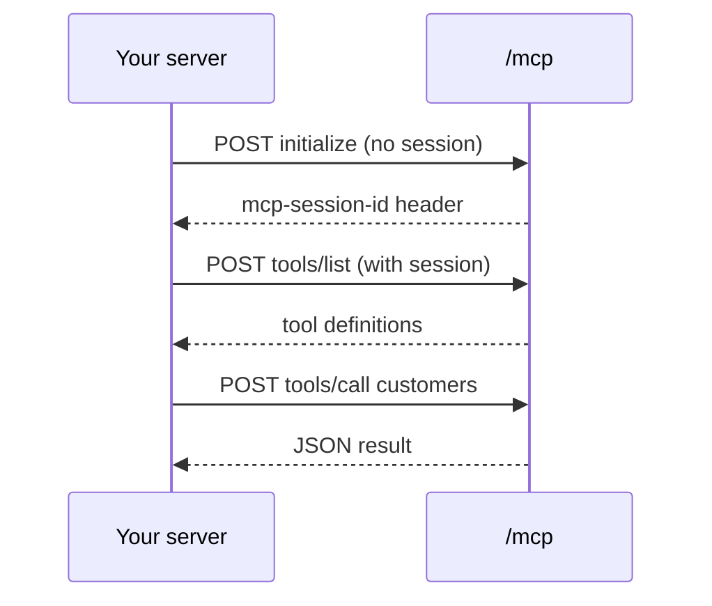
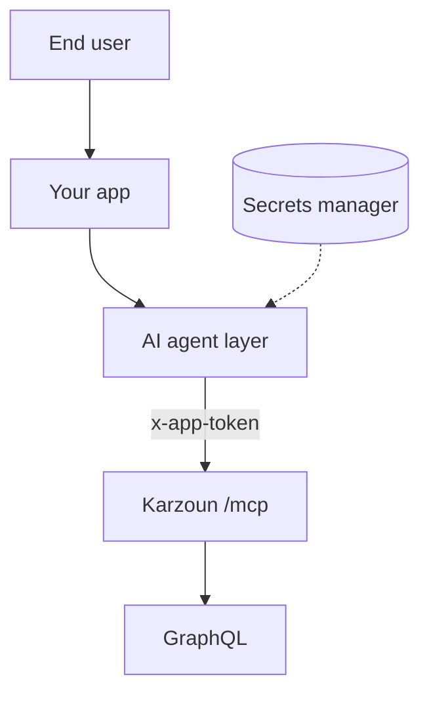

استدعِ كرزون MCP عبر **Streamable HTTP** من الخلفية — أو اربط **تطبيقات الذكاء الاصطناعي السحابية** (Claude، Manus، ChatGPT، Cursor عن بُعد) بنفس نقطة النهاية.

**جديد:** دليل الموصّلات خطوة بخطوة → [موصّلات تطبيقات الذكاء الاصطناعي](/ar/mcp-server/setup/ai-connectors)

```
https://{subdomain}.api.karzoun.chat/mcp
```

<Warning title="من جهة الخادم فقط">
  لا تستدعِ `/mcp` من JavaScript في المتصفح أبدًا. سيتعرّض رمز التطبيق للمستخدمين النهائيين. استخدم الخلفية أو عاملًا موثوقًا.
</Warning>

## متى تستخدم المستضاف

| استخدم المستضاف                                     | استخدم stdio بدلًا منه               |
| ---------------------------------------------- | -------------------------------- |
| وكيل ذكاء اصطناعي منشور على بنيتك       | البرمجة المحلية في Cursor / Claude |
| مهمة Cron أو عامل طابور يحتاج أدوات CRM           | استكشاف لمرة واحدة             |
| وكيل SaaS متعدد المستأجرين يمرّر رموزًا لكل عميل | جهاز التطوير الشخصي            |

## المصادقة

يتطلب كل طلب نفس الترويسة المستخدمة في GraphQL:

```
x-app-token: YOUR_APP_TOKEN_JWT
```

اختياري: `x-subdomain` عندما توجّه بوابتك المستأجرين عبر الترويسة.

## مصافحة الجلسة



1. **POST** `initialize` — بدون `mcp-session-id` بعد
2. اقرأ **`mcp-session-id`** من ترويسات الاستجابة
3. **POST** `tools/list`، `tools/call`، وغيرها مع تلك الترويسة في كل طلب لاحق

الجلسات مرتبطة بعملية البوابة — أعد التهيئة بعد عمليات النشر أو فترات الخمول الطويلة.

## مثال التهيئة

```bash
curl -sD - -X POST 'https://YOUR.api.karzoun.chat/mcp' \
  -H 'Content-Type: application/json' \
  -H 'Accept: application/json, text/event-stream' \
  -H 'x-app-token: YOUR_TOKEN' \
  -d '{
    "jsonrpc": "2.0",
    "id": 1,
    "method": "initialize",
    "params": {
      "protocolVersion": "2024-11-05",
      "capabilities": {},
      "clientInfo": { "name": "my-agent", "version": "1.0.0" }
    }
  }'
```

احفظ ترويسة `mcp-session-id` من الاستجابة.

## سرد الأدوات

```bash
curl -X POST 'https://YOUR.api.karzoun.chat/mcp' \
  -H 'Content-Type: application/json' \
  -H 'Accept: application/json, text/event-stream' \
  -H 'x-app-token: YOUR_TOKEN' \
  -H 'mcp-session-id: YOUR_SESSION_ID' \
  -d '{"jsonrpc":"2.0","id":2,"method":"tools/list","params":{}}'
```

## استدعاء أداة

```bash
curl -X POST 'https://YOUR.api.karzoun.chat/mcp' \
  -H 'Content-Type: application/json' \
  -H 'Accept: application/json, text/event-stream' \
  -H 'x-app-token: YOUR_TOKEN' \
  -H 'mcp-session-id: YOUR_SESSION_ID' \
  -d '{
    "jsonrpc": "2.0",
    "id": 3,
    "method": "tools/call",
    "params": {
      "name": "tags",
      "arguments": { "page": 1, "perPage": 5 }
    }
  }'
```

## نمط البنية



خزّن الرموز في مدير أسرار؛ وحقنها لكل مستأجر إذا كنت تشغّل SaaS متعدد المستأجرين.

## الحدود

- نفس صلاحيات GraphQL وسلوك المعدّل كما في الاستدعاءات المباشرة للواجهة
- حد افتراضي لاستجابة الأداة **512 كيلوبايت** (قابل للضبط على تركيبات البوابة المستضافة ذاتيًا)
- راجع [الأمان](/ar/mcp-server/setup/security) للتدوير وتحديد النطاق

## الخطوات التالية

- [موصّلات تطبيقات الذكاء الاصطناعي](/ar/mcp-server/setup/ai-connectors) — Claude، Manus، ChatGPT، Cursor عن بُعد
- [أنماط الوكلاء](/ar/mcp-server/guides/agent-patterns) — أوامر عمال المستضاف
- [كيف يعمل](/ar/mcp-server/guides/how-it-works) — الأخطاء وحدود الحجم
- [استكشاف الأخطاء](/ar/mcp-server/guides/troubleshooting) — أخطاء الجلسة و401
