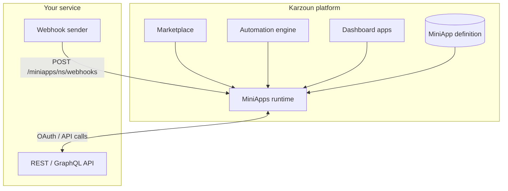

ميني أب هو **مستند JSON واحد** تؤلّفه وتقدّمه إلى كرزون. بعد المراجعة والموافقة، تستضيف كرزون التعريف وتشغّله وقت التشغيل. لا تنشر خوادم أو قواعد بيانات على بنيتنا التحتية.

يعلن المستند عن:

- **المصادقة** — كيف يربط المستأجرون حساباتهم (OAuth 2.0 أو مفتاح API)
- **الإجراءات** — استدعاءات API التي يمكن للمستخدمين والأتمتة تشغيلها
- **المشغّلات** — الأحداث التي تظهر في منشئ الأتمتة
- **الويب هوك** — كيف تُتحقَّق أحداث المزوّد الواردة وتُحلَّل
- **المزامنة** (اختياري) — الاستيراد الجماعي ومزامنة التجارة في الوقت الفعلي لمنصات التجارة الإلكترونية
- **المصادر** — قوائم منسدلة مدعومة بـ RPC في نماذج الإجراءات

تفسّر كرزون المستند وقت التشغيل. السلوك مُعلَن في JSON — بدون كود خادم مخصص من جانبك.

## وثائق ذات صلة

- [ويب هوك المستأجر](/ar/developers/guides/webhooks) — ويب هوك صادرة على مستوى مساحة العمل (منفصلة عن ويب هوك ميني أب الواردة)
- [برنامج الشركاء](/ar/partners) — تكاملات العلامة البيضاء والتجارة المضمّنة
