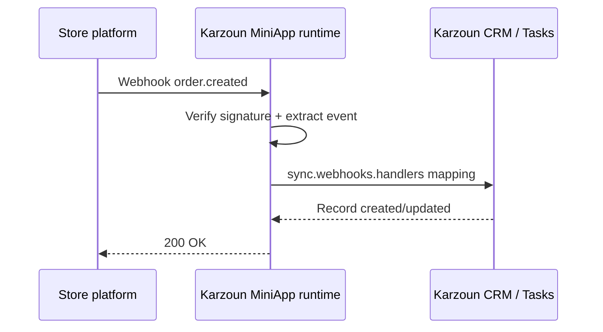

تربط ميني أب التجارة الإلكترونية منصات المتاجر (Salla وZid وWooCommerce والمكدسات المخصصة) بـ **الطلبات** و**العملاء** و**المنتجات** و**السلال المتروكة** في كرزون.

## النهج الموصى به

استخدم كتلة **`sync`** — وليس `webhook.ecommerce` القديمة.

| القدرة            | الإعداد                          |
| --------------------- | ----------------------------------------- |
| الاستيراد الجماعي           | `sync.resources.*` مع `apiMapping`    |
| الطلبات/السلال في الوقت الفعلي | `sync.webhooks.handlers`                |
| تفاعلات الأتمتة  | إدخالات `triggers[]` مطابقة            |
| ربط العملاء      | `webhook.customerExtraction`             |

المرجع الكامل: [دليل المزامنة](/ar/miniapps/guides/sync).

## التدفق النموذجي

1. يثبّت المستأجر ميني أبك من السوق.
2. يخزّن OAuth أو مفتاح API بيانات الاعتماد على تثبيت المستأجر.
3. تصل ويب هوك المزوّد إلى `POST /miniapps/{ns}/webhooks`.
4. تربط المعالجات الحمولات إلى سجلات تجارة كرزون.
5. تستخدم الأتمتة المشغّلات (مثل `order.created`) لسير العمل.

## ما يجب تضمينه في تعريفك

- **مصادقة تطابق المنصة** — OAuth 2.0 مع `auto_refresh: true` عند وجود رموز تحديث؛ **HTTP Basic** (`Basic [[key]]:[[secret]]`) لمفاتيح REST بأسلوب WooCommerce؛ ترويسات مخصصة لرموز Shopify Admin — انظر [المصادقة](/ar/miniapps/guides/authentication)
- **`webhook.verification`** — استراتيجية HMAC أو رمز من مزوّدك
- **`webhook.customerExtraction`** — ربط حقول المشتري بعملاء كرزون
- **`sync.resources`** — المنتجات والعملاء والطلبات حسب الحاجة
- **`sync.webhooks.handlers`** — ربطات إنشاء/تحديث لكل حدث
- **`triggers`** — واحد لكل حدث ظاهر في الأتمتة

انظر [مثال Salla](/ar/miniapps/examples/salla) لنمط كامل.

## `webhook.ecommerce` القديمة

`webhook.ecommerce` **مهملة**. يجب أن تستخدم التقديمات الجديدة `sync`. قد ترفض كرزون التعريفات التي تعتمد فقط على الكتلة القديمة.

إذا كنت تصون تكاملاً قديماً، تواصل مع دعم كرزون لمراجعة الترحيل.

## الشركاء

يجب على شركاء التجارة (Salla وZid وMatjrah وWooCommerce) أيضاً قراءة [برنامج الشركاء](/ar/partners) لتدفقات العلامة البيضاء والتأهيل المضمّن.

## Shopify

يتصل Shopify عبر **Shop Domain + Admin API Access Token + API Secret Key**.

- ترويسة المصادقة: `X-Shopify-Access-Token`
- HMAC للويب هوك: `X-Shopify-Hmac-Sha256` مع `encoding: 'base64'`
- تُطبَّع المواضيع من `orders/create` → `order.created` (إلخ)
- مزامنة الكتالوج الجماعية معطّلة افتراضياً (يستخدم Shopify ترقيم صفحات cursor/`Link`)؛ عمليات upsert الفورية عبر الويب هوك مفعّلة
- البحث حسب SKU يستخدم Admin GraphQL `productVariants`

## WooCommerce

يتصل WooCommerce عبر **Consumer Key + Consumer Secret + Store URL** (مفاتيح REST API). يتضمن إجراءات البحث بالبريد/SKU/رقم الطلب، وHMAC للويب هوك (`encoding: 'base64'`)، ومزامنة الكتالوج.

- المصادقة: HTTP Basic عبر `Authorization: 'Basic [[consumerKey]]:[[consumerSecret]]'` (يشفّر وقت التشغيل `key:secret` بـ Base64) — انظر [المصادقة → HTTP Basic Auth](/ar/miniapps/guides/authentication#http-basic-auth)
- HMAC للويب هوك: `X-WC-Webhook-Signature` مع `encoding: 'base64'`
