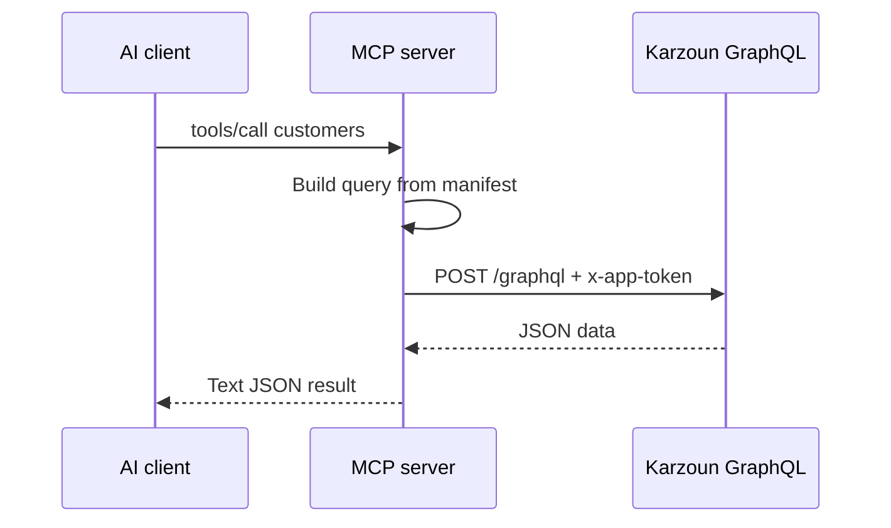

Karzoun MCP is a thin bridge: **one MCP tool = one public GraphQL operation**. No hidden APIs, no extra abstraction layer.

## Request path



1. The agent picks a tool (e.g. `customerDetail`) and passes arguments.
2. The MCP server builds a GraphQL query or mutation from the committed tool manifest.
3. The server POSTs to your tenant GraphQL URL with `x-app-token`.
4. The result is returned as JSON text to the agent.

The same [app token permissions](/developers/getting-started/authentication) apply — if the app cannot run an operation in the Playground, MCP cannot run it either.

## Tool naming

Tool names **match GraphQL operation names** exactly:

| Tool           | GraphQL operation            |
| -------------- | ----------------------------- |
| `tags`         | `query tags(...)`            |
| `customersAdd` | `mutation customersAdd(...)` |
| `webhooks`     | `query webhooks(...)`        |

Browse the full list in the [tool catalog](/mcp-server/tools/catalog). Field-level documentation lives in the [GraphQL reference](/api-reference).

## Limiting tools

Large manifests can overwhelm smaller models. Set a prefix to expose only what you need:

```json
"env": {
  "KARZOUN_API_URL": "https://YOUR.api.karzoun.chat/graphql",
  "KARZOUN_APP_TOKEN": "YOUR_TOKEN",
  "KARZOUN_MCP_TOOL_PREFIX": "customers"
}
```

Only tools whose names start with `customers` are registered (e.g. `customers`, `customersAdd`, `customerDetail`).

## Response size

Responses are capped at **512 KB** by default (`KARZOUN_MCP_MAX_RESPONSE_BYTES`). If a list query returns too much data, the tool fails with a clear error — narrow `page` / `perPage` or filter arguments, same as [pagination](/developers/guides/pagination) in GraphQL.

## Errors

Failed tools return JSON with an `error` field:

```json
{ "error": "Permission denied" }
```

HTTP failures, GraphQL validation errors, and oversize responses all surface this way. Teach your agent to read the message and adjust arguments.

## Stdio vs hosted

| Transport  | Process                               | Token source                          |
| ---------- | ---------------------------------------- | ---------------------------------------- |
| **stdio**  | Local Node process spawned by the IDE | `KARZOUN_APP_TOKEN` in MCP config env |
| **Hosted** | Gateway route `POST /mcp`             | `x-app-token` header per request      |

Hosted mode also supports optional `x-subdomain` when routing through multi-tenant gateways. See [Hosted MCP](/mcp-server/setup/hosted).

## What MCP does not do

- Stream inbox real-time events — use [webhooks](/developers/guides/webhooks)
- Register MiniApps — see [MiniApps](/miniapps)
- Bypass permission checks — apps are scoped in **Developer → Apps**
