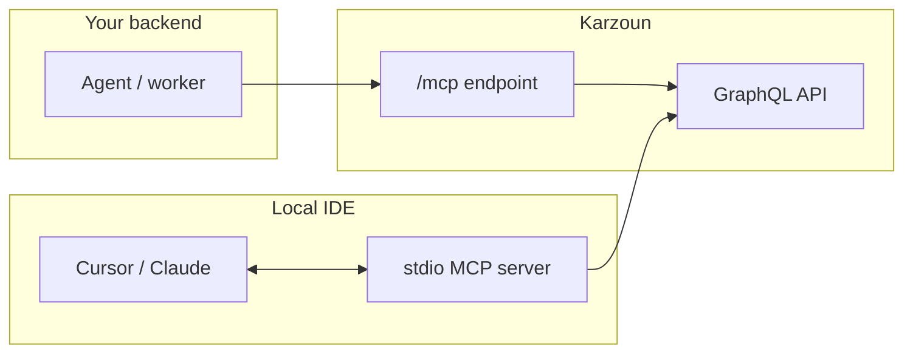

Give AI assistants **structured access** to your Karzoun workspace — customers, tags, products, users, webhooks, and more — through the [Model Context Protocol](https://modelcontextprotocol.io/).

The `@karzounchat/mcp-server` package maps the **public GraphQL API** to MCP tools **one-to-one**. When an agent calls `customers`, it runs the same operation you would send from the [Playground](https://karzoun.chat/developer/playground) or your backend.

**Package:** [`@karzounchat/mcp-server`](https://www.npmjs.com/package/@karzounchat/mcp-server)
**Source:** [KarzounApps/mcp-server](https://github.com/KarzounApps/mcp-server)

<Tip title="Video overview">
  **Coming soon:** _Karzoun MCP in 3 minutes_ — what MCP is, when to use stdio vs hosted, and a live Cursor demo. _(Embed placeholder)_
</Tip>

## Choose your setup

|                 | **Local (stdio)**                                                     | **Hosted (`/mcp`)**                                                     |
| --------------- | --------------------------------------------------------------------- | ----------------------------------------------------------------------- |
| **Best for**    | Cursor, Claude Desktop, local dev                                     | Backend agents, automations, SaaS workers                               |
| **Runs as**     | `npx @karzounchat/mcp-server` on your machine                         | HTTP on Karzoun gateway                                                 |
| **Token lives** | MCP config `env` (your laptop)                                        | Your server only — never the browser                                    |
| **Setup guide** | [Cursor](/mcp-server/setup/cursor) · [Claude Desktop](/mcp-server/setup/claude-desktop) | [AI connectors](/mcp-server/setup/ai-connectors) · [Hosted MCP](/mcp-server/setup/hosted) |

## Prerequisites

1. **App token** — Create in **Developer → Apps** ([authentication guide](/developers/getting-started/authentication))
2. **GraphQL URL** — `https://{subdomain}.api.karzoun.chat/graphql` ([quickstart](/developers/getting-started/quickstart))
3. **Permissions** — Scope the app to the operations your agent needs

<Warning title="Not a replacement for GraphQL">
  MCP is a **convenience layer for AI clients**. Production integrations that do not need an LLM should call GraphQL or [webhooks](/developers/guides/webhooks) directly.
</Warning>

## Start here

| Step | Guide                                                                                                                                    |
| ---- | ---------------------------------------------------------------------------------------------------------------------------------------- |
| 1    | [How it works](/mcp-server/guides/how-it-works) — Tools, auth, and responses                                                                      |
| 2    | Pick a setup: [Cursor](/mcp-server/setup/cursor), [AI connectors](/mcp-server/setup/ai-connectors) (Claude, Manus, ChatGPT…), or [Hosted](/mcp-server/setup/hosted) |
| 3    | [Agent patterns](/mcp-server/guides/agent-patterns) — Prompts that work well                                                                      |
| 4    | [Tool catalog](/mcp-server/tools/catalog) — All **75+** operations                                                                     |

## Configuration reference

| Variable                         | Required | Description                            |
| --------------------------------- | -------- | --------------------------------------- |
| `KARZOUN_API_URL`                | Yes      | GraphQL endpoint URL                   |
| `KARZOUN_APP_TOKEN`              | Yes      | App JWT from `appsAdd`                 |
| `KARZOUN_MCP_TOOL_PREFIX`        | No       | Limit tools (e.g. `tags`, `customers`) |
| `KARZOUN_MCP_MAX_RESPONSE_BYTES` | No       | Response cap (default: 524288)         |

Older environment variable names from previous releases are still accepted as fallbacks.

## Related

- [Security](/mcp-server/setup/security) — Token handling and permissions
- [Troubleshooting](/mcp-server/guides/troubleshooting) — Common MCP errors
- [Developers hub](/developers) — API, webhooks, playground
