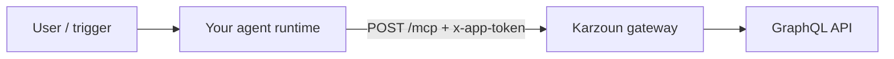

Hosted MCP turns your Karzoun workspace into **live tools** for cloud AI agents — the same GraphQL operations you use in the [Playground](https://karzoun.chat/developer/playground), exposed as named MCP tools an LLM can call on your behalf.

Use this guide when the AI app runs in the **cloud** (Claude.ai, Manus, ChatGPT, remote Cursor) and must reach Karzoun over **HTTPS**, not `npx` on your laptop.

<Tip title="In-app setup">
  Open **Developer → MCP setup** in Karzoun (`/developer/mcp-setup`) for your tenant-specific endpoint URL and a copy-ready `initialize` curl example.
</Tip>

## Your connection details

Collect these once before connecting any client:

| Field            | Value                                                                                             |
| ---------------- | --------------------------------------------------------------------------------------------------- |
| **MCP URL**      | `https://{subdomain}.api.karzoun.chat/mcp`                                                        |
| **Auth header**  | `x-app-token: YOUR_APP_JWT`                                                                       |
| **Transport**    | Streamable HTTP (POST + optional GET stream)                                                      |
| **Token source** | **Developer → Apps** — [authentication guide](/developers/getting-started/authentication) |

```bash
# Quick sanity check (save mcp-session-id from response headers)
curl -sD - -X POST 'https://YOUR.api.karzoun.chat/mcp' \
  -H 'Content-Type: application/json' \
  -H 'Accept: application/json, text/event-stream' \
  -H 'x-app-token: YOUR_TOKEN' \
  -d '{"jsonrpc":"2.0","id":1,"method":"initialize","params":{"protocolVersion":"2024-11-05","capabilities":{},"clientInfo":{"name":"test","version":"1.0.0"}}}'
```

Full handshake: [Hosted MCP](/mcp-server/setup/hosted).

<Warning title="Server-side tokens only">
  Never paste app tokens into browser extensions, shared ChatGPT configs, or client-side code. Connect from a trusted AI host or your own backend. See [Security](/mcp-server/setup/security).
</Warning>

## What you unlock

Karzoun exposes **75+ tools** mapped 1:1 to the public GraphQL API. The agent does not need to invent query syntax — it calls tools by operation name (`customers`, `tasksAdd`, `webhooks`, …).

Browse the full list: [tool catalog](/mcp-server/tools/catalog).

### By domain

| Domain             | Example tools                                  | What an agent can do                                    |
| ------------------ | ----------------------------------------------- | ---------------------------------------------------------- |
| **Contacts & CRM** | `customers`, `companies`, `tags`, `tagsTag`    | Look up people, segment lists, apply tags               |
| **Inbox**          | `conversations`, `conversationMessageAdd`      | Read threads, draft or send replies (within app scope)  |
| **Tasks**          | `tasks`, `tasksAdd`, `tasksBoards`             | List work, create follow-ups, inspect boards            |
| **Webhooks**       | `webhooks`, `webhooksAdd`                      | Register outbound event subscriptions                   |
| **Knowledge base** | `knowledgeBaseSearch`, `knowledgeBaseArticles` | Ground answers in your help content                     |
| **Apps**           | `apps`, `appsAdd`                              | Inspect or rotate integration credentials (admin scope) |

### Prompts that show the power

Once connected, try natural-language requests like:

- _"List my 10 most recently updated customers and summarize their tags."_
- _"Find open tasks assigned to me on the Sales board and group by due date."_
- _"Search the knowledge base for return policy and draft a short customer reply."_
- _"Show webhook subscriptions for customer events — which URLs are active?"_
- _"Find the conversation with alice@example.com and summarize the last 5 messages."_

Pair MCP with [agent patterns](/mcp-server/guides/agent-patterns) so the model reads before it mutates.

<Tip title="Screenshot / video placeholder">
  _Coming soon: screen recording — connect hosted MCP, then run a CRM lookup + tag workflow in one prompt._
</Tip>

## Choose the right client

| Client                                    | Local stdio               | Hosted `/mcp`            | Auth Karzoun expects                      |
| ------------------------------------------ | -------------------------- | ------------------------- | -------------------------------------------- |
| [Cursor](#cursor-remote)                  | Yes (recommended for dev) | Yes                      | `x-app-token` header                      |
| [Claude Desktop](/mcp-server/setup/claude-desktop)       | Yes                       | Remote via Connectors UI | Header or OAuth (client-dependent)        |
| [Claude.ai](#claudeai)                    | —                         | Yes                      | Custom connector URL; see auth note below |
| [Manus](#manus)                           | —                         | Yes                      | HTTP + API key / custom headers           |
| [ChatGPT Apps](#chatgpt-apps-and-connectors) | No                        | Yes (remote only)        | Often OAuth 2.1 — see caveat              |
| [Claude Code](#claude-code)               | —                         | Yes                      | HTTP transport + headers                  |
| Your backend                              | —                         | Yes                      | `x-app-token` on every request            |

**Rule of thumb:** If the client lets you set **custom HTTP headers**, hosted Karzoun MCP works today. If the client only supports **OAuth discovery** (common for ChatGPT Apps), you need a small proxy or a backend agent until OAuth is available on Karzoun.

## Claude.ai

Claude on the web supports **custom remote MCP connectors** (Settings → Connectors → Add custom connector).

<Steps>
  <Step title="Create an app token">
    In Karzoun: **Developer → Apps** → create an app with the permissions your agent needs (start read-only: customers, tags, tasks).
  </Step>

  <Step title="Add the connector">
    1. Open [Claude Connectors](https://claude.ai/settings/connectors) (or **Admin → Connectors** on Team/Enterprise).
    2. Click **Add custom connector**.
    3. **Server URL:** `https://{subdomain}.api.karzoun.chat/mcp`
    4. If the UI offers **Advanced** auth fields and your plan supports static credentials, prefer routing through a header-aware client (Cursor remote, Manus, or your backend) until OAuth is documented for Karzoun.
  </Step>

  <Step title="Enable in chat">
    Use the **+** menu in a conversation → **Connectors** → enable Karzoun for that chat.

    Test: _"Using Karzoun tools, run currentUser and list my first 5 tags."_
  </Step>
</Steps>

<Info title="Claude Desktop vs Claude.ai">
  **Claude Desktop** for local coding is still best with [stdio](/mcp-server/setup/claude-desktop). **Remote connectors** in Claude.ai are for cloud sessions — do not add the HTTPS URL to `claude_desktop_config.json`; use the Connectors UI instead.
</Info>

## Manus

[Manus](https://manus.im/) supports **Custom MCP servers** over HTTP — a strong fit for hosted Karzoun because you can point at a public `/mcp` URL and supply credentials.

<Steps>
  <Step title="Open Custom MCP">
    **Settings → Integrations → Custom MCP** (or **+ Add custom MCP → Direct configuration**).
  </Step>

  <Step title="Enter server details">
    | Field              | Value                                                                                    |
    | ------------------ | ------------------------------------------------------------------------------------------ |
    | **Name**           | `Karzoun` (or your workspace name)                                                       |
    | **Transport**      | `HTTP` / Streamable HTTP                                                                 |
    | **Server URL**     | `https://{subdomain}.api.karzoun.chat/mcp`                                               |
    | **Authentication** | API key / Bearer / custom — map to `x-app-token` if the UI exposes a custom header field |

    If Manus only offers a single **API key** field and sends `Authorization: Bearer`, use a thin reverse proxy on your infrastructure that translates `Authorization: Bearer <token>` → `x-app-token: <token>` (advanced; keep the proxy private).
  </Step>

  <Step title="Test and use">
    Manus verifies the server and lists discovered tools. Reference Karzoun in prompts:

    _"Pull my top 10 customers by last updated date and create a Manus doc summarizing their tags."_

    Official reference: [Manus custom MCP docs](https://manus.im/docs/integrations/custom-mcp).
  </Step>
</Steps>

## ChatGPT Apps and Connectors

OpenAI supports **remote MCP** through **Apps / Connectors** (Developer Mode in ChatGPT settings). ChatGPT connects from OpenAI's cloud — **local stdio does not work**.

<Steps>
  <Step title="Enable developer access">
    In ChatGPT: **Settings → Apps & Connectors** (or **Connectors → Advanced**) → enable **Developer mode** if available on your plan.
  </Step>

  <Step title="Add your MCP URL">
    Create a new app/connector and paste:

    ```
    https://{subdomain}.api.karzoun.chat/mcp
    ```

    Review discovered tools before enabling the app in conversations.
  </Step>
</Steps>

<Warning title="OAuth requirement">
  Many ChatGPT connector flows expect **OAuth 2.1** with dynamic client registration. Karzoun hosted MCP authenticates with **`x-app-token`** (same as the public GraphQL API), not OAuth discovery endpoints.

  **What works today:** connect via [Manus](#manus), [Cursor remote](#cursor-remote), [Claude Code](#claude-code), or your own backend agent calling `/mcp` directly.

  **For ChatGPT specifically:** if connector setup fails at authentication, run Karzoun tools from a backend worker (your server holds the token) or use an MCP gateway that adds OAuth in front of Karzoun. We will document first-party OAuth for ChatGPT when available.
</Warning>

## Cursor (remote)

For teams that prefer **not** to run `npx` locally, Cursor supports **remote MCP** via `url` + `headers` in `mcp.json`.

```json
{
  "mcpServers": {
    "karzoun-hosted": {
      "url": "https://YOUR_SUBDOMAIN.api.karzoun.chat/mcp",
      "headers": {
        "x-app-token": "${env:KARZOUN_APP_TOKEN}"
      }
    }
  }
}
```

Export `KARZOUN_APP_TOKEN` in your shell profile (desktop apps may not load `.zshrc` — use system env or Cursor's supported secret patterns).

**Cursor Settings → MCP** should show **connected** with ~75 tools. Prefer [local stdio](/mcp-server/setup/cursor) for offline development; use **hosted** when `npx` is blocked or you want a single shared endpoint.

Docs: [Cursor MCP — remote servers](https://cursor.com/docs/mcp).

## Claude Code

[Claude Code](https://docs.anthropic.com/en/docs/claude-code) can register HTTP MCP servers from the CLI:

```bash
claude mcp add --transport http karzoun \
  https://YOUR_SUBDOMAIN.api.karzoun.chat/mcp \
  --header "x-app-token: YOUR_APP_TOKEN"
```

Use a project `.mcp.json` for repo-scoped access. Rotate tokens via **Developer → Apps** if the CLI config is shared.

## Build your own agent

Any stack that speaks **Streamable HTTP MCP** can call Karzoun:



Typical hosts: LangGraph, custom Node/Python workers, Zapier-style automations, internal Slack bots.

1. `POST initialize` → capture `mcp-session-id`
2. `POST tools/list` → discover operations
3. `POST tools/call` → execute with GraphQL-shaped arguments

Examples and curl: [Hosted MCP](/mcp-server/setup/hosted). Prompt design: [Agent patterns](/mcp-server/guides/agent-patterns).

## Scope tokens for safer agents

Before connecting a powerful client:

| Goal                    | App permissions                     | Optional env                            |
| ------------------------ | ------------------------------------- | ------------------------------------------ |
| Read-only CRM assistant | Query customers, tags, companies    | `KARZOUN_MCP_TOOL_PREFIX` on stdio only |
| Support triage          | Conversations + knowledge base read | Narrow app scope in UI                  |
| Integration admin       | Webhooks + apps mutations           | Separate high-privilege token           |

Start with a **read-only** app, validate prompts, then issue a broader token if needed.

## Troubleshooting connectors

| Symptom                        | Likely cause                          | Fix                                           |
| -------------------------------- | ---------------------------------------- | ------------------------------------------------ |
| 401 Missing `x-app-token`      | Header not sent                       | Add header in client config or proxy          |
| 400 invalid session            | Skipped `initialize` or stale session | Re-run handshake; see [Hosted MCP](/mcp-server/setup/hosted) |
| Tools empty / permission error | App scope too narrow                  | Widen permissions; test in Playground         |
| Client cannot reach URL        | Private network / localhost           | Use public `*.api.karzoun.chat` only          |
| ChatGPT auth fails             | OAuth-only connector                  | Use Manus, Cursor remote, or backend agent    |

More: [Troubleshooting](/mcp-server/guides/troubleshooting).

## Next steps

- [Hosted MCP](/mcp-server/setup/hosted) — Protocol details and curl reference
- [Agent patterns](/mcp-server/guides/agent-patterns) — Reliable multi-step prompts
- [Tool catalog](/mcp-server/tools/catalog) — Every operation name
- [Security](/mcp-server/setup/security) — Token rotation and incident response
