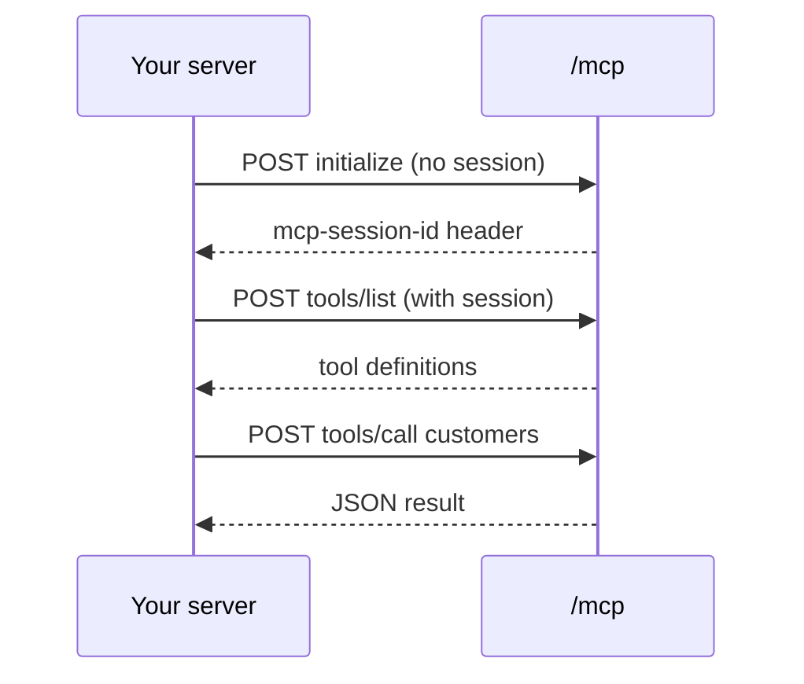
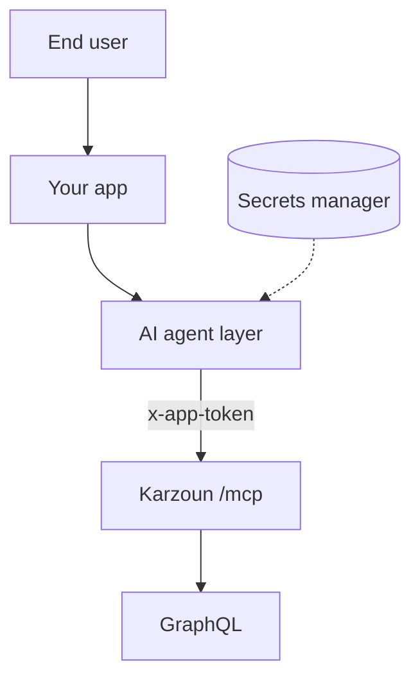

Call Karzoun MCP over **Streamable HTTP** from your backend — or connect **cloud AI apps** (Claude, Manus, ChatGPT, remote Cursor) to the same endpoint.

**New:** Step-by-step connector guide → [AI app connectors](/mcp-server/setup/ai-connectors)

```
https://{subdomain}.api.karzoun.chat/mcp
```

<Warning title="Server-side only">
  Never call `/mcp` from browser JavaScript. The app token would be exposed to end users. Use your backend or a trusted worker.
</Warning>

## When to use hosted

| Use hosted                                     | Use stdio instead               |
| ---------------------------------------------- | -------------------------------- |
| Deployed AI agent on your infrastructure       | Local coding in Cursor / Claude |
| Cron or queue worker needs CRM tools           | One-off exploration             |
| Multi-tenant SaaS proxying per-customer tokens | Personal dev machine            |

## Authentication

Every request requires the same header as GraphQL:

```
x-app-token: YOUR_APP_TOKEN_JWT
```

Optional: `x-subdomain` when your gateway routes tenants by header.

## Session handshake



1. **POST** `initialize` — no `mcp-session-id` yet
2. Read **`mcp-session-id`** from response headers
3. **POST** `tools/list`, `tools/call`, etc. with that header on every follow-up

Sessions are tied to the gateway process — re-initialize after deploys or long idle periods.

## Initialize example

```bash
curl -sD - -X POST 'https://YOUR.api.karzoun.chat/mcp' \
  -H 'Content-Type: application/json' \
  -H 'Accept: application/json, text/event-stream' \
  -H 'x-app-token: YOUR_TOKEN' \
  -d '{
    "jsonrpc": "2.0",
    "id": 1,
    "method": "initialize",
    "params": {
      "protocolVersion": "2024-11-05",
      "capabilities": {},
      "clientInfo": { "name": "my-agent", "version": "1.0.0" }
    }
  }'
```

Save the `mcp-session-id` header from the response.

## List tools

```bash
curl -X POST 'https://YOUR.api.karzoun.chat/mcp' \
  -H 'Content-Type: application/json' \
  -H 'Accept: application/json, text/event-stream' \
  -H 'x-app-token: YOUR_TOKEN' \
  -H 'mcp-session-id: YOUR_SESSION_ID' \
  -d '{"jsonrpc":"2.0","id":2,"method":"tools/list","params":{}}'
```

## Call a tool

```bash
curl -X POST 'https://YOUR.api.karzoun.chat/mcp' \
  -H 'Content-Type: application/json' \
  -H 'Accept: application/json, text/event-stream' \
  -H 'x-app-token: YOUR_TOKEN' \
  -H 'mcp-session-id: YOUR_SESSION_ID' \
  -d '{
    "jsonrpc": "2.0",
    "id": 3,
    "method": "tools/call",
    "params": {
      "name": "tags",
      "arguments": { "page": 1, "perPage": 5 }
    }
  }'
```

## Architecture pattern



Store tokens in a secrets manager; inject per tenant if you operate multi-tenant SaaS.

## Limits

- Same GraphQL permissions and rate behavior as direct API calls
- Default **512 KB** tool response cap (configurable on self-hosted gateway mounts)
- See [Security](/mcp-server/setup/security) for rotation and scoping

## Next steps

- [AI app connectors](/mcp-server/setup/ai-connectors) — Claude, Manus, ChatGPT, Cursor remote
- [Agent patterns](/mcp-server/guides/agent-patterns) — Hosted worker prompts
- [How it works](/mcp-server/guides/how-it-works) — Error and size limits
- [Troubleshooting](/mcp-server/guides/troubleshooting) — Session and 401 errors
