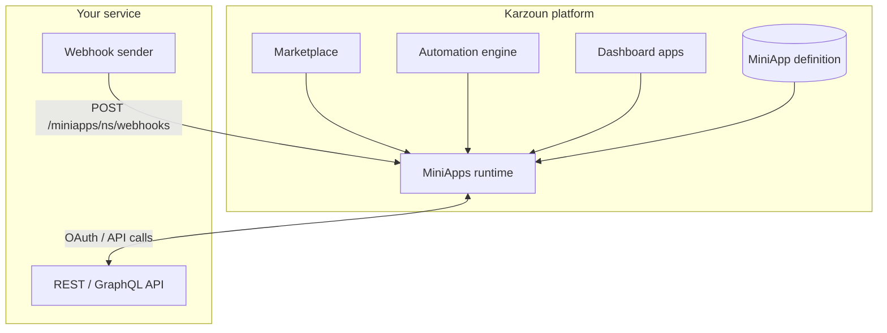

A MiniApp is a **single JSON document** you author and submit to Karzoun. After review and approval, Karzoun hosts the definition and runs it at runtime. You do not deploy servers or databases on our infrastructure.

The document declares:

- **Authentication** — How tenants connect accounts (OAuth 2.0 or API key)
- **Actions** — API calls users and automations can run
- **Triggers** — Events that appear in the Automation Builder
- **Webhooks** — How inbound provider events are verified and parsed
- **Sync** (optional) — Bulk import and realtime commerce sync for e-commerce platforms
- **Sources** — RPC-backed dropdowns in action forms

Karzoun interprets the document at runtime. Behavior is declared in JSON — no custom server code on your side.

## Related docs

- [Tenant webhooks](/developers/guides/webhooks) — Workspace-level outbound webhooks (separate from MiniApp inbound webhooks)
- [Partners program](/partners) — Whitelabel and embedded commerce integrations
