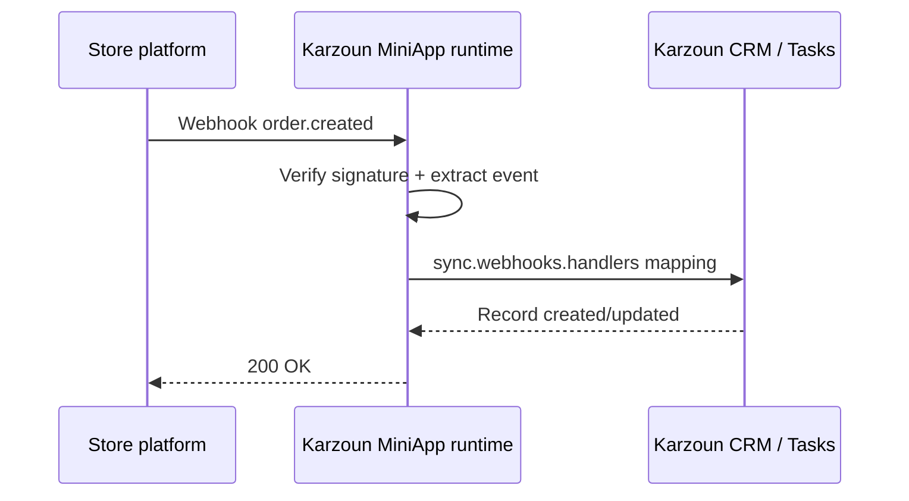

E-commerce MiniApps connect storefront platforms (Salla, Zid, WooCommerce, custom stacks) to Karzoun **orders**, **customers**, **products**, and **abandoned carts**.

## Recommended approach

Use the **`sync` block** — not legacy `webhook.ecommerce`.

| Capability            | Configuration                          |
| --------------------- | ----------------------------------------- |
| Bulk import           | `sync.resources.*` with `apiMapping`    |
| Realtime orders/carts | `sync.webhooks.handlers`                |
| Automation reactions  | Matching `triggers[]` entries            |
| Customer linking      | `webhook.customerExtraction`             |

Full reference: [Sync guide](/miniapps/guides/sync).

## Typical flow

1. Tenant installs your MiniApp from Marketplace.
2. OAuth or API key stores credentials on the tenant install.
3. Provider webhooks hit `POST /miniapps/{ns}/webhooks`.
4. Handlers map payloads into Karzoun commerce records.
5. Automations use triggers (e.g. `order.created`) for workflows.

## What to include in your definition

- **Auth that matches the platform** — OAuth 2.0 with `auto_refresh: true` when refresh tokens exist; **HTTP Basic** (`Basic [[key]]:[[secret]]`) for WooCommerce-style REST keys; custom headers for Shopify Admin tokens — see [Authentication](/miniapps/guides/authentication)
- **`webhook.verification`** — HMAC or token strategy from your provider
- **`webhook.customerExtraction`** — Map buyer fields into Karzoun customers
- **`sync.resources`** — Products, customers, orders as needed
- **`sync.webhooks.handlers`** — Create/update mappings per event
- **`triggers`** — One per automation-visible event

See the [Salla example](/miniapps/examples/salla) for a complete pattern.

## Legacy `webhook.ecommerce`

`webhook.ecommerce` is **deprecated**. New submissions must use `sync`. Karzoun may reject definitions that rely solely on the legacy block.

If you are maintaining an older integration, contact Karzoun support for a migration review.

## Partners

Commerce partners (Salla, Zid, Matjrah, WooCommerce) should also read the [Partners program](/partners) for whitelabel and embedded onboarding flows.

## Shopify

Shopify connects with **Shop Domain + Admin API Access Token + API Secret Key**.

- Auth header: `X-Shopify-Access-Token`
- Webhook HMAC: `X-Shopify-Hmac-Sha256` with `encoding: 'base64'`
- Topics normalized from `orders/create` → `order.created` (etc.)
- Bulk catalog sync is disabled by default (Shopify uses cursor/`Link` pagination); realtime webhook upserts are enabled
- Find-by-SKU uses Admin GraphQL `productVariants`

## WooCommerce

WooCommerce connects with **Consumer Key + Consumer Secret + Store URL** (REST API keys). Includes find-by-email/SKU/order-number actions, webhook HMAC (`encoding: 'base64'`), and catalog sync.

- Auth: HTTP Basic via `Authorization: 'Basic [[consumerKey]]:[[consumerSecret]]'` (runtime Base64-encodes `key:secret`) — see [Authentication → HTTP Basic Auth](/miniapps/guides/authentication#http-basic-auth)
- Webhook HMAC: `X-WC-Webhook-Signature` with `encoding: 'base64'`
